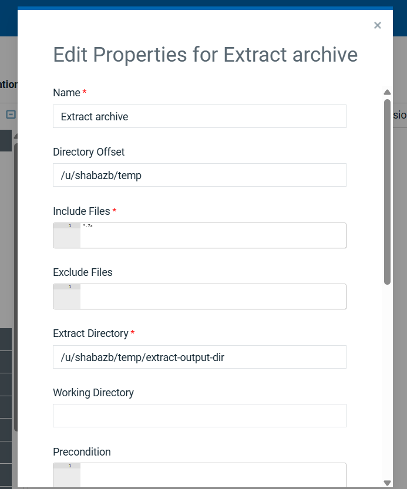

# Usage

## Configuring the Extract Archive Step
This step extracts files from an archive file (e.g., a .7z file) to a specified directory. 
Configure the following properties to control the extraction process.

### Name
A descriptive name for this extraction step.

**Example:** Extract web assets

### Directory Offset
The path to the directory containing the archive file(s) you want to extract.

**Example:** /u/shabazb/temp

### Include Files
Specify the archive file(s) to be extracted. You can use wildcards (*) to include multiple files.

**Example:** To extract all .7z files in the offset directory, use *.7z.

### Exclude Files
(Optional) Specify any files or patterns inside the archive that you want to exclude from the extraction process.

### Extract Directory
The full path to the destination folder where the contents of the archive will be placed.

**Example:** /u/shabazb/temp/extract-output-dir

